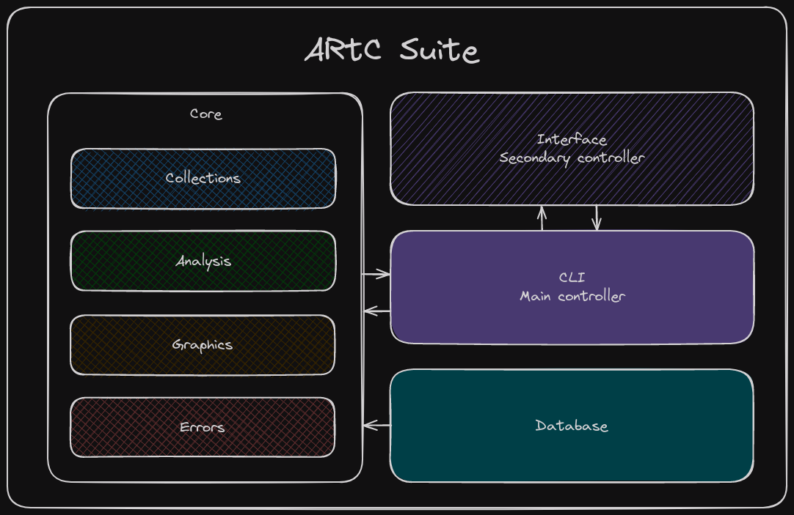

# artc-suite
**ARtC (Audio Real-time Comparator)** is a software suite designed to compare and analyze audio files in real time.

> **IMPORTANT:** This project is under construction. The potatoes are being harvested, stay tuned.

